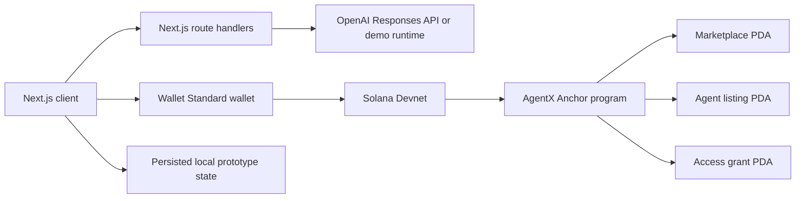

# AgentX

AgentX is a Solana Devnet marketplace prototype for publishing, purchasing, and running focused AI agents. It combines a production-built Next.js application, Wallet Standard connectivity, a guarded AI runtime, deterministic demo fallbacks, and an Anchor access registry.

The product is aimed at Solana protocol operators, analysts, traders, and research teams that need repeatable workflows but cannot safely buy a black-box prompt. Every listing makes its scope, pricing policy, creator, metadata hash, and evidence limits inspectable before payment.

## Product Status

Working now:

- Browse and filter eight Solana-native seed agents.
- Connect Phantom, Solflare, Backpack, or another Wallet Standard wallet.
- Send a real native SOL transfer on Devnet for prototype settlement.
- Grant permanent, 30-day, or one-run access according to the listing policy.
- Run agents through `/api/ai/chat` with rate limiting and Zod validation.
- Use deterministic, clearly labeled demo analysis when no OpenAI key is set.
- Create and persist creator-built draft agents with deterministic Solana PDAs.
- Track purchases, runs, access, notifications, votes, and creator settings locally.
- Inspect responsive marketplace, dashboard, profile, settings, governance, and runtime views.

Built and ready for a funded Devnet deployment:

- `programs/agentx_marketplace` contains the Anchor marketplace, listing, and access-grant PDAs.
- The program implements configurable fee splitting, permanent access, timed subscriptions, run credits, access consumption, events, constraints, and custom errors.
- `anchor build` produces the reviewed IDL and TypeScript contract in `src/idl` for program ID `Ccgw6kq1PQfE5zx6EpFixNEafvRMu4udzZuNWmvzTqHA`.
- A wallet-funded Devnet deployment and marketplace initialization are still required before the UI can replace prototype direct transfers with atomic program settlement.

The app never labels seed listings as on-chain verified. Draft and demo states remain visible in the UI.

## Architecture



Ownership boundaries:

- Client: wallet discovery, transaction approval, UI state, and user-visible access policy.
- Route handlers: input validation, rate limiting, model credentials, bounded agent context, and deterministic fallback.
- Solana program: settlement, fee split, listing ownership, access expiry, run credits, and immutable event history.
- Metadata: the current prototype stores creator drafts locally and anchors a SHA-256 metadata digest in the listing model.

See [docs/ARCHITECTURE.md](docs/ARCHITECTURE.md) for account seeds, trust boundaries, and the deployment path.

## Local Setup

Requirements:

- Node.js 20 or newer
- npm 10 or newer
- A Wallet Standard Solana wallet for signed Devnet flows

```bash
npm install
npm run dev
```

Open `http://localhost:3000`.

Copy `.env.example` to `.env.local` and change only the values needed for your environment. Never expose `OPENAI_API_KEY` through a `NEXT_PUBLIC_` variable.

## Environment

| Variable | Required | Purpose |
| --- | --- | --- |
| `NEXT_PUBLIC_SOLANA_CLUSTER` | No | Defaults to `devnet`. |
| `NEXT_PUBLIC_SOLANA_RPC_URL` | No | Defaults to the public Devnet RPC. Use a dedicated provider for demos. |
| `NEXT_PUBLIC_SOLANA_WS_URL` | No | Defaults to the public Devnet WebSocket endpoint. |
| `NEXT_PUBLIC_MARKETPLACE_PROGRAM_ID` | No | Program ID used for PDA derivation. |
| `OPENAI_API_KEY` | No | Enables live server-side AI runs. Missing key activates demo mode. |
| `OPENAI_MODEL` | No | Server-selected Responses API model. |
| `AUTH_SECRET` | Production | Signs short-lived wallet session cookies. |

## Quality Checks

```bash
npm run lint
npm run typecheck
npm run test:run
npm run build
```

The Vitest suite covers request schemas, PDA stability, access labels, one-run credit consumption, subscription expiry, and creator access.

## Anchor Program

The workspace pins Anchor CLI and crates to `1.0.2` and Solana tooling to `3.1.10` in `Anchor.toml`.

After installing Rust and AVM in Linux or WSL:

```bash
avm install 1.0.2
avm use 1.0.2
anchor keys sync
anchor build
npm run test:program
anchor test
```

Before Devnet deployment:

1. Keep the generated program keypair private and confirm it resolves to the configured program ID.
2. Fund the deployment wallet with enough Devnet SOL for the program-data and buffer accounts.
3. Run `anchor deploy`, then verify the executable account on Devnet.
4. Initialize the marketplace PDA with a separate treasury account and the desired fee basis points.
5. Use the checked-in IDL client when replacing prototype direct transfers with atomic program settlement.

Program deployment spends wallet funds and requires explicit wallet approval.

## Business Model

- Initial wedge: security, analytics, and protocol-operations agents for Solana teams.
- Supply acquisition: onboard domain experts with creator tooling and transparent pricing.
- Revenue: configurable marketplace fee on one-time, subscription, and per-run settlement.
- Retention: repeat workflows, usage history, creator reputation, and composable access records.
- Expansion: verified metadata storage, SPL-token settlement, organization workspaces, private agents, and program-to-program agent access.

The seed metrics are demonstration data, not claimed traction. A production launch should track activation, paid conversion, repeat runs, creator earnings, dispute rate, and 30-day buyer retention.

## Security Notes

- Private keys and seed phrases are never requested or stored.
- AI credentials stay in server-only code.
- User input is bounded and validated before reaching the model provider.
- Paid runs require a short-lived Ed25519 wallet challenge and Devnet payment proof.
- The runtime explicitly distinguishes supplied facts, inference, and uncertainty.
- In-memory rate limiting is suitable for a single demo instance; production should use a shared store such as Redis.
- Local access grants are prototype state. Only deployed program PDAs should be treated as authoritative.
- Direct SOL transfer is a prototype fallback and is not atomic with the local access grant. The Anchor path removes this gap.

## Demo

Use [docs/DEMO_SCRIPT.md](docs/DEMO_SCRIPT.md) for the short judge-facing walkthrough. A free agent can demonstrate the complete AI flow without a wallet signature; paid access and deployment require explicit approvals.
